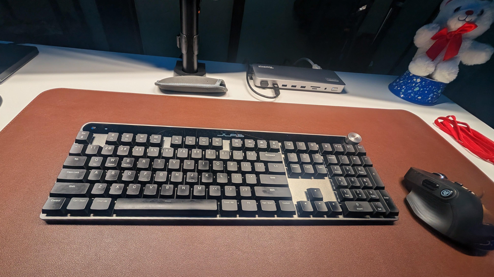

Image: JLab Mechanical Keyboard - Image Credit: Michael Schaecher *

Being a part-time tech enthusiast and a full-time poor working man, I often find myself torn between wanting the latest gadgets and sticking to a budget. This comes into sharp when I came to enhancing my home work space: I offend find myself buying off-brand or budget versions of popular tech products. In most cases this works out fine, but sometimes you get what you pay for especially when it comes to the fly by night companies that pop up on [Amazon](https://www.amazon.com/) or [eBay](https://www.ebay.com/).

when it comes to off-brand devices it is best to stick to items sold at the local big box stores like [Best Buy](https://www.bestbuy.com/) or [Walmart](https://www.walmart.com/). These retailers have a return policy and customer service that can help you if the product does not meet your expectations. One such product I recently purchased is the [JLab Mechanical Keyboard](https://www.jlab.com/products/epic-mechanical-wireless-keyboard-black).

Being of low income class I opted to hold at whenever possible for sells and discounts. That means only shopping during Cyber Monday/Black Friday and waiting for items to go on clearance. The best time to buy tech gadgets is during between early March and late April when retailers are trying to clear out inventory for new products. Stores like **Best Buy** and **Walmart** well mark down items to below cost.

Yes they still make money on the products one from the sell and then claiming a loss on paper for insurance and tax purposes.

So when I saw that the JLab Mechanical Keyboard was on sale for $64.99 down from $129.99. That is a 50% discount I decided to bought it.

From the moment that I opened the box I was by the uses of cardboard instead of plastic or foam. This type of packaging is is often times cheaper and more environmentally friendly, it also makes the unboxing experience feel more premium. Plus the foam ends up making a mess and getting everywhere.

> Specifications:
>
> - **Connectivity**: Wireless (2.4GHz) and Bluetooth 5.1 x 2 devices
> - **Battery Life**: Up to 4+ months (backlit off), 19+ days (backlit on max)
> - **Form Factor**: Full-size with numpad
> - **Key Switches**: Mechanical ([Kailh Choc V2 Low Profile Switch](https://www.kailh.net/products/kailh-choc-v2-low-profile-switch-set?variant=43775877972210)) - Brown (tactile)
> - **Backlighting**: Nutural white LED backlighting with adjustable brightness
> - **Compatibility**: Windows, macOS, iOS, Android and Linux (no software support)
> - **Dimensions**: 17.1" x 5.92" x 1.08"
> - **Weight**: 1.65 lbs
> - **Additional Features**: Multimedia keys, adjustable feet, USB-C charging port
> - **Materials**: ABS plastic keycaps and bottom chassis with Aluminum ABS plated upper chassis
> - **Price**: $129.99 (MSRP)
> - **Warranty**: 2-year limited warranty

From the moment I started using the keyboard I was impressed by the build quality, but it was the typing experience that really stood out. I now know why mechanical keyboards are so popular. The tactile feedback and audible click are satisfying and make typing a joy. The brown **Kailh Switches** are perfect for both typing and gaming, providing a good balance between responsiveness and comfort. With a 50+ million keystroke lifespan, these switches are built to last. That is longer than most people will keep the keyboard.

In fact I think the switches will outlast the battery of the keyboard.

The wireless connectivity is solid although if left idle for long periods the keyboard does go into a deep sleep mode, meaning that there is a delay until the keyboard reconnects to the wireless receiver. There is no reconnect if the connected device is via the Bluetooth. I found that out with the companion [JLab Epic 2 Wireless Mouse](https://www.jlab.com/products/epic-wireless-mouse-2-black) I got a month prior.

One of the things I appreciate is that the keyboard came with a full charged battery right out of the box. This is a small detail that many manufacturers overlook, but it shows that JLab cares about the user experience. Wanting plug it in and go. Cause let's face it using a keyboard is pretty straight forward, even a wireless one with a dongle.

Overall I am very satisfied with my purchase of the JLab Mechanical Keyboard. It offers great value for the price, especially when purchased on sale. The build quality, typing experience, and wireless connectivity make it a standout option in the budget mechanical keyboard market. If you are looking for an affordable mechanical keyboard that doesn't compromise on quality, I highly recommend giving the JLab Mechanical Keyboard a try.

I just wish I can say the same for there audio products that commonly available at either **Best Buy** or **Walmart**. Most of them are just a disappointment when it comes to comfort for my ears.

Pros:

- Affordable price, especially on sale
- Solid build quality with aluminum top plate
- Satisfying typing experience with tactile brown switches
- Wireless connectivity with Bluetooth and 2.4GHz options
- Long battery life
- No RGB distractions

Cons:

- No software support for customization (Linux only)
- Deep sleep mode can cause delay in reconnection
- Basic backlighting options (no RGB)
