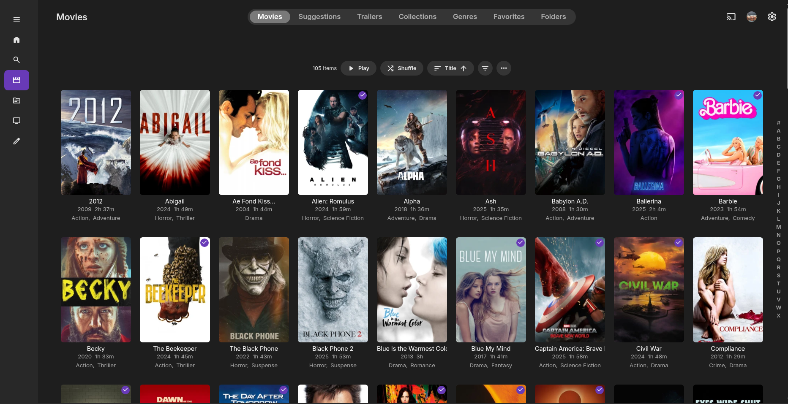

When online streaming services first became popular, they were a game-changer and affordable way to access a wide variety of movies and tv shows. However, as time went on, many people found themselves subscribing to multiple services just to access all the content they wanted to watch. This can quickly become expensive and overwhelming and defeated the purpose of cutting the cord in the first place. The biggest drawback of streaming services is the buying of content in that if the service decides to remove or lose the rights to a movie or tv show, it can disappear from the platform without warning. This can be frustrating for viewers who may have been looking forward to watching a particular title, only to find out that it's no longer available. Additionally, streaming services often have a rotating selection of content, which means that even if a movie or tv show is currently available, it may not be there for long. This can make it difficult for viewers to keep track of what they want to watch and when it's available.

This has caused a rise for physical media collections once again especially for the young generation who may have never experienced the joy of owning a physical copy of their favorite movies and tv shows.

However, the problem with physical media is that it be damaged (mostly cause by improper storage and handling like placing the discs in direct sunlight or placing them label side down) and can be lost. This is where having a digital backup of your collection can be a lifesaver. By ripping your physical media and storing it on a hard drive for access later at any time, you can ensure that your collection is safe and easily accessible. This also allows you to watch your movies and tv shows on a variety of devices, such as your computer, tablet, or smart TV, without having to worry about the physical media.

Now I'm assuming that you have some knowledge of how to rip your physical media and store it on a hard drive if you don't, there are plenty of resources available online that can guide you through the process.[^1]

[MakeMKV](https://www.makemkv.com/) works with most Blu-Ray and DVD drives with a firmware change, if that sounds intimidating then I would recommend using the [LG BP50NB40](https://www.lg.com/us/burners-drives/lg-bp50nb40-external-blu-ray-dvd-drive) if you need an external drive or [LG WH16NS40](https://www.lg.com/us/burners-drives/lg-wh16ns40-internal-blu-ray-dvd-drive) if you want an internal drive. Both of these drives are compatible with MakeMKV without the LibreDrive firmware change and are reasonably priced. Once you have your drive and software set up, you can start ripping your physical media and building your digital collection.

> Note: Ripping damaged or scratched Blu-Rays can be more difficult due to the higher wave length of the laser used to read the disc. This only applies high speed reading/ripping of the disc. So don't assume the disc is completely unreadable if you have trouble ripping it. It is just the nature of the technology and the damage to the disc. You can try cleaning the disc or using a different drive to see if it can be read.

So what movies and tv shows would you find at a you local library? You would be surprised at the variety of titles and how new some of them are; a few times I have found found current physical releases. Sadly though due to some states laws, some libraries have had to remove certain titles caused by some peoples complaining about the content (Modern Family, The Simpsons, etc.).

Now this is where storage space can become an issue. A single Blu-Ray can take up to 50+ GB of storage space, so if you have a large collection, you will need a lot of storage space to store it all. However, transcoding your ripped media to a more compressed format can help save space while still maintaining good quality. There are many software options available for transcoding, but the best one is [HandBrake](https://handbrake.fr/). HandBrake is a free and open-source transcoder that can convert your ripped media into a more compressed format, such as H.264 or H.265, which can significantly reduce the file size while still maintaining good quality. Not only that you can passthrough the original audio and subtitle tracks, so you don't lose any of the features of your original media.[^2] This can be especially useful when a a lower resolution movie like a DVD is ripped. Transcoding allows you to upscale the video to a higher resolution to full HD (1080p) with the right settings, which can improve the overall viewing experience on modern devices.

> Note: Transcoding a 720p movie to 4k will cause a significant loss in quality and is not recommended. Transcoding a 1080p movie to 4k can be done with good results if the right settings are used, but it is still not recommended as it will not improve the quality of the original media and can cause some loss in quality.

Some high end TV's as will as gaming consoles have the ability to upscale to full 4k with very good results as lone as the original media is at least 1080p. So if you have a 4k TV or gaming console, you may not need to transcode your media to 4k as the TV or console can do it for you.

In conclusion, using your local library to build your digital movie and tv show collection can be a great way to access a wide variety of titles without having to subscribe to multiple streaming services. By ripping your physical media and storing it on a hard drive, you can ensure that your collection is safe and easily accessible. Transcoding your media can also help save space while still maintaining good quality. With the right setup and software, you can enjoy your movie and tv show collection on a variety of devices without worrying about the limitations of streaming services or the fragility of physical media.

[^1]: [Whitson Gordon (PCMag): How to Rip Your DVDs and Blu-rays](https://www.pcmag.com/how-to/how-to-rip-blu-ray-discs-to-your-pc?test_uuid=04IpBmWGZleS0I0J3epvMrC&test_variant=B)

[^2]: [HandBrake: Supported Formats](https://handbrake.fr/docs/en/latest/technical/containers.html)
