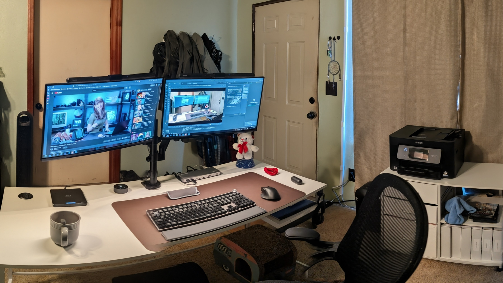

Image: My Laptop Setup - Image Credit: Michael Schaecher *

Up until recently my setup consisted of my laptop and a docking station and a cluttered desk. For about 3 years that was it. Did I think about upgrading my setup? Yes, but I would talk myself out of it thinking that it would not make work flow any better.

I was wrong, it only took 3 years to realize that.

Think the only reason I held off was I thought it that having an external monitor(s), keyboard, and mouse was only for people that used tower PCs instead of laptops. After all laptops are portable and meant to be used on the go. Right? And that was all I had to work with and I had to save up for 5 months to get the setup I was working with now.

> **Past Setup**
>
> | Component       | Model/Details                                      |
> |-----------------|----------------------------------------------------|
> | Laptop          | Dell Inspiron 5505 (AMD Ryzen 5 4500U, 16GB RAM, 512GB NVMe SSD, Integrated AMD Graphics) |
> | Docking Station | [j5create JCD3198 Dual 4K](https://www.walmart.com/ip/j5create-USB-C-Dual-4K-HDMI-Dock-Without-PD-3-1-Pass-Through-Charging-5-12x5-12-in-and-14-7-oz-JCD3198/5066099512) |
> | Desk            | [Mainstays Two-Way Convertible](https://www.walmart.com/ip/Mainstays-Two-Way-Convertible-Desk-with-Lower-Storage-Shelf-Black-Wood-Grains-Finish-and-Black-Metal-Frame/421078359) |
> | Chair           | [Mainstays Ergonomic Mesh Back](https://www.walmart.com/ip/Mainstays-Ergonomic-Mesh-Back-Task-Office-Chair-with-Flip-up-Arms-Black-Fabric-275-lb/2205851521) |
> | Lighting        | Standard Overhead Room Light                        |

It worked for me, but I always felt cramped and limited in what I could do. The laptop screen was small, and the keyboard and trackpad were not comfortable for long typing sessions. Plus, the desk was cluttered with cables and accessories.

Thing that that caused me to finally upgrade my setup was the state of things with prices and A.I. companies gobbling up everything in sight. I knew it was time to invest in a better setup that will improve my productivity and comfort and last me for years to come. The main thing is that laptop has no need to be upgraded thanks to the fact that I'm running Ubuntu Linux and the hardware is still more than capable of handling my daily tasks. So getting a new laptop was out of the question.

This meant that I needed to focus on what I needed to improve my workstation experience. Which kind of changed as I started the process. The first thing that I did was get a second monitor and paired it with wireless keyboard and mouse. This made a huge difference in my productivity. However,

The monitor I chose was the [ONN 24-inch Full HD 180Hz](https://www.walmart.com/ip/onn-24-FHD-1920-x-1080p-165hz-1ms-Adaptive-Sync-Gaming-Monitor-with-Cables-Black/346540473) that I got as an open-box item for $56 USD from [Walmart](https://www.walmart.com/) online store. It was a great deal for a monitor that supports 1080p resolution at 180Hz refresh rate. The colors and viewing angles are decent for the price, and it has a sleek design that fits well with my setup.

I quickly realized that now I had a more cluttered desk with now a laptop, monitor, keyboard, mouse, and docking station all taking up space. I needed a mounting solution to free up desk space. So I went with a laptop + monitor mount combo from [VIVO](https://vivo-us.com/collections/laptop-desk-mounts/products/stand-v102l). My initial thought was to use the laptops built-in monitor along with the external monitor, but the difference in refresh rates, brightness, contrast and color reproduction it started to annoy me after a while. so I decided to get a second identical monitor to match the first one. And of course I got it as another open-box item from Walmart. This one however no care was taken with the packaging and the monitor arrived with major screen damage. Needless to say I was not happy and had to return it. Opting to pay full price for the replacement this time around. At $115 USD it was still a good deal for a 24-inch 1080p 180Hz monitor.

Did this left me with a laptop that was now in the way again. The only solution was to mount the laptop under the desk using a [VIVO Laptop Under Desk Mount](https://vivo-us.com/collections/laptop-desk-mounts/products/mount-udls1).

I now had a clean dual monitor setup with a wireless keyboard and mouse, however I found out that my laptop is limited to supporting only one external monitor via DisplayPort ALT Mode over USB-C. Meaning that I could only use one of the monitors with the docking station. The other monitor had to be connected via HDMI directly to the laptop. This was not ideal, but it worked for now. A way around this would be to get a docking station that supports dual monitors via DisplayLink technology, but I need one with good documented Linux support.

I thought about getting a Dell WD19TB Thunderbolt Docking Station, however I wanted on that had a good number of ports at the front for easy access: The Dell WD19TB did not and there was some doubt the Thunderbolt controller would work properly with my laptop's USB-C port. So I did a lot of [Googling](https://www.google.com/) and walked away with 2 options: Going with either [Plugable](https://plugable.com) or [CalDigit](https://www.caldigit.com). Both companies have a good reputation for Linux support.

**Plugable Options:**

| Docking Station Model | Price (USD) | Key Features | Pros | Cons |
|----------------------|-------------|--------------|------|------|
| [Plugable UD-6950H](https://plugable.com/products/ud-6950h/) | $199.00 | Dual 4K DisplayPort/HDMI, USB-C and USB-A ports, Gigabit Ethernet | Good Linux support, Multiple video outputs | Bulky design |
| [Plugable UD-6950PDH](https://plugable.com/products/ud-6950pdh/) | $179.99 | Dual 4K DisplayPort/HDMI, USB-C Power Delivery, USB-A ports, Gigabit Ethernet | Affordable, USB-C Power Delivery | No vertical stand |
| [Plugable UD-3900PDZ ](https://plugable.com/products/ud-3900pdz/) | $149.99 | Triple display support, USB-C Power Delivery, USB-A ports, Gigabit Ethernet | 100W Power Delivery | Limited USB ports |

**CalDigit Options:**

| Docking Station Model | Price (USD) | Key Features | Pros | Cons |
|----------------------|-------------|--------------|------|------|
| [CalDigit TS4](https://www.caldigit.com/ts4-thunderbolt-station-4/) | $349.99 | Dual 4K DisplayPort/HDMI, Thunderbolt 4, USB-C and USB-A ports, SD Card Reader, Gigabit Ethernet | Extensive port selection, High build quality | Expensive |
| [CalDigit TS5](https://www.caldigit.com/ts5-thunderbolt-station-5/) | $399.99 | Dual 4K DisplayPort/HDMI, Thunderbolt 4, USB-C and USB-A ports, SD Card Reader, Gigabit Ethernet | High performance, Multiple video outputs | Very expensive |

While going with Thunderbolt docks would give me more future proofing, it was the pricing that made me go with the [Plugable UD-6950PDH](https://plugable.com/products/ud-6950pdh/) for $179.99 USD. It offered a good balance of features and price, and I was confident in its Linux compatibility based on user reviews and Plugable's reputation.

With the new docking station in place, I was able to connect both monitors via DisplayPort and enjoy a seamless dual-monitor experience. And yes **DisplayPort ALT Mode** would be better, because there is less overhead on the CPU compared to DisplayLink technology, but this was the best option for my current laptop. I did discover that for some reason [Firefox](https://www.mozilla.org/en-US/firefox) cause more CPU usage when using DisplayLink compared to Chromium-based browsers. So I switched to using [Brave Browser](https://brave.com/) for my daily browsing needs.

So with that done I now had a clean and efficient laptop setup that improved my productivity and comfort. The dual monitors allowed me to multitask more effectively, and the wireless keyboard and mouse provided a more ergonomic typing experience. The desk mount helped to declutter my workspace, giving me more room to work.

I was happy until I saw the [JLab Mechanical Keyboard](https://www.jlab.com/products/epic-mechanical-wireless-keyboard-black) on sale for 50% off at [Best Buy](https://www.bestbuy.com/) during Black Friday. I could not resist the deal; so I bought it to replace the perfectly good wireless keyboard that I got a month prior. You can read my full review of the keyboard [here](../my-view-on-the-jlab-mechanical-keyboard/). However when I got the keyboard I was unable to return the previous keyboard due because I was past the return window. So I sold it on [eBay](https://www.ebay.com/) in order to recoup some of the cost.

The last step was to improve the lighting in my workspace. At first I thought that I did not have to pay no more the $20 USD for a basic desk monitor light. So I got a cheap [Quntis LED Monitor Light Bar](https://www.walmart.com/ip/Quntis-Computer-Monitor-Light-Bar-Screen-Light-with-Touch-Sensor-USB-LED-Desk-Lamp-Stepless-Screen-Monitor-Light-Bar-for-Eye-Caring/9087215539) from Walmart. While it worked, because it was cheaply made and had poor build quality, it set on top of the monitor unevenly and the lip that was supposed to hold it in place kept overhanging the edge of the monitor. So I opted for a better quality option from [Quntis](https://quntis.com/) directly. I went with the [Quntis ScreenLinear Pro](https://www.amazon.com/dp/B08DKQ3JG1) for $39.95 USD and got 2: One for each monitor. The plus for the ScreenLinear Pro is that it has a better build quality and a wireless remote control. Pairing both with one remote allows me to control both lights at the same time. The color temperature and brightness levels are adjustable, allowing me to create the perfect lighting environment for my workspace. how ever I turned the auto brightness feature on so that the light adjusts based on the ambient light in the room.

Sometime I use my desk as a workshop area for small electronics projects. So having a good light source is important.

Overall, upgrading my laptop setup has been a game-changer for my productivity and comfort. The investment was worth it, and I wish I had done it sooner. If you are considering upgrading your laptop setup, I highly recommend taking the plunge. You won't regret it!

Pros:

- Improved productivity with dual monitors
- Enhanced comfort with wireless keyboard and mouse
- Decluttered workspace with desk mounts
- Better lighting with adjustable monitor light bars
- Increased multitasking capabilities

Cons:

- Initial cost of investment
- Bit more overhead on CPU with DisplayLink technology
- Impulsive purchase of second keyboard

> *Disclaimer: I am not affiliated with any of the companies or products mentioned in this blog post. All opinions expressed are my own based on my personal experience.*
