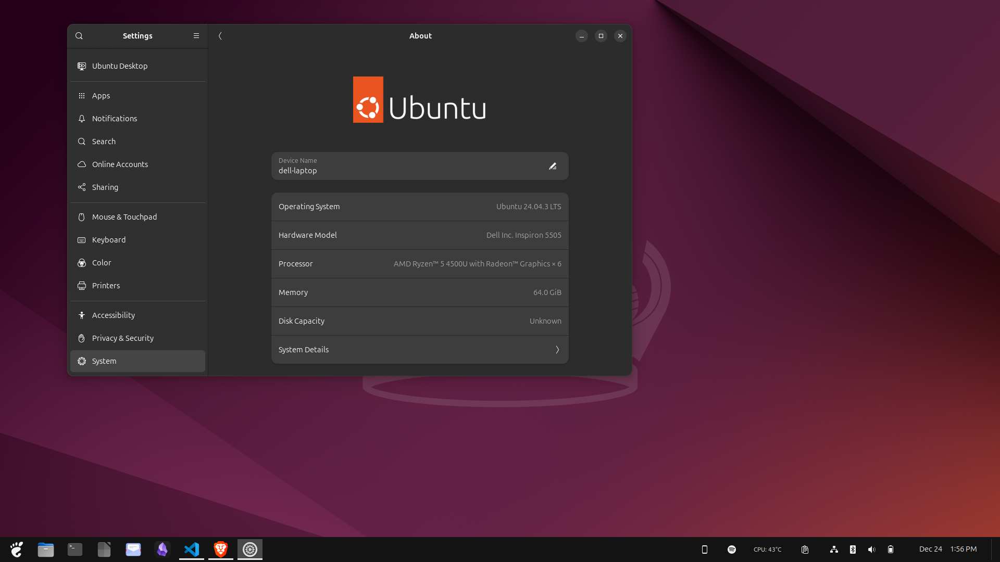

**Image Credit**: *Michael Schaecher*

I've been using Linux for more then a decade now, and over the years, I've experimented with various distributions (including Arch). Doing this allowed me to understand what I truly value in an operating system.

When I first got into Linux, Ubuntu could be installed as an app for Windows, but in order to get it to working properly one had to change the filesystem from case insensitive to case sensitive with a registry hack. After about a couple months I decided to dual boot Ubuntu and Windows 7. This was a time that not everything worked (WiFi drivers were a pain to get working), but I was determined to make it work So I ran an Ethernet cable from my router to computer.

Over time I found myself using Ubuntu more and Windows less. Eventually I made the leap to using Linux full time. When I did this I switched to [Arch Linux](https://archlinux.org) via [Manjaro](https://manjaro.org/). I liked the rolling release model and the ability to customize everything. However, I found that I was spending more time fixing issues and less time being productive. The constant updates and occasional breakages were frustrating. But I stuck with it for a while, hoping that I would get used to it and talked myself into believing that this was the "true" Linux experience that I should embrace. Granted at the time in 2012/2013 that was the general consensus in the Linux community because it was true.

Fast forward a few years I had to use Windows 10/11 as my daily driver and the only way that I could run Linux was via WSL (Windows Subsystem for Linux). Boy did I use WSL a lot for development and other tasks that could be done in a Linux environment. However, I found myself missing the full Linux experience and the ability to customize my environment to my liking. When the I finally was able to toss Windows aside for good I switched back this time going with full **Arch** installation. The problem that where there years ago where no longer there, but now I had new problems. And that was trying to get my printer/scanner to work. After hours of trying to get it to work I finally gave up and decided to switch to [Fedora](https://www.fedoraproject.org/). Fedora worked well for a while, but I was not the type of user that **Fedora** targets. Fedora is great for cutting edge software and developers that work in an enterprise environment like a small business to large corporation. Because of this **Fedora** is a bit more rigid in terms of security and being a single user on my personal computer I found this to be a hindrance.

I did think about trying out [openSUSE](https://www.opensuse.org/), but the face that the organization behind it keeps changing hands made me hesitant wondering about its long term viability. After all I wanted a distribution that I could rely on for years to come without worrying about it being discontinued or losing support. So I tried out [Debian](https://www.debian.org/). While **Debian** is known for its stability and reliability, I found the hardware support to be lacking. So I decided to give **Ubuntu** another try.

**Image Credit**: *Tima Miroshnichenko from Pexels*

I'm not saying that **Ubuntu** is better then other distributions, but for my use case of having a stable, reliable hardware support, and a large community for support, it fits my needs.

For those that say that **Ubuntu** is a bloated version of **Debian**, I would argue to the bloated part, however, [Canonical](https://canonical.com/) has made significant strides in making **Ubuntu** more better for hardware support and performance. The inclusion of proprietary drivers and software out of the box makes it easier for users to get up and running quickly without having to manually install additional packages.

## Conclusion

In the end, my journey through Linux distributions was less about finding the most “pure” or technically impressive system and more about identifying what enables me to be productive day after day. Each distribution I used taught me something valuable—Arch emphasized control and transparency, Fedora highlighted modern tooling and security practices, and Debian reinforced the importance of long-term stability. However, those strengths often came with trade-offs that did not align with how I actually use my personal computer.

Ubuntu ultimately represents a pragmatic balance. It may not satisfy every purist ideal, but it consistently delivers reliable hardware support, sensible defaults, and an ecosystem that minimizes friction without eliminating choice. For me, that balance matters more than ideological alignment or marginal technical advantages. After more than a decade of experimentation, I have learned that the “best” Linux distribution is not the one that demands the most effort, but the one that quietly gets out of the way and allows me to focus on the work I want to do.
