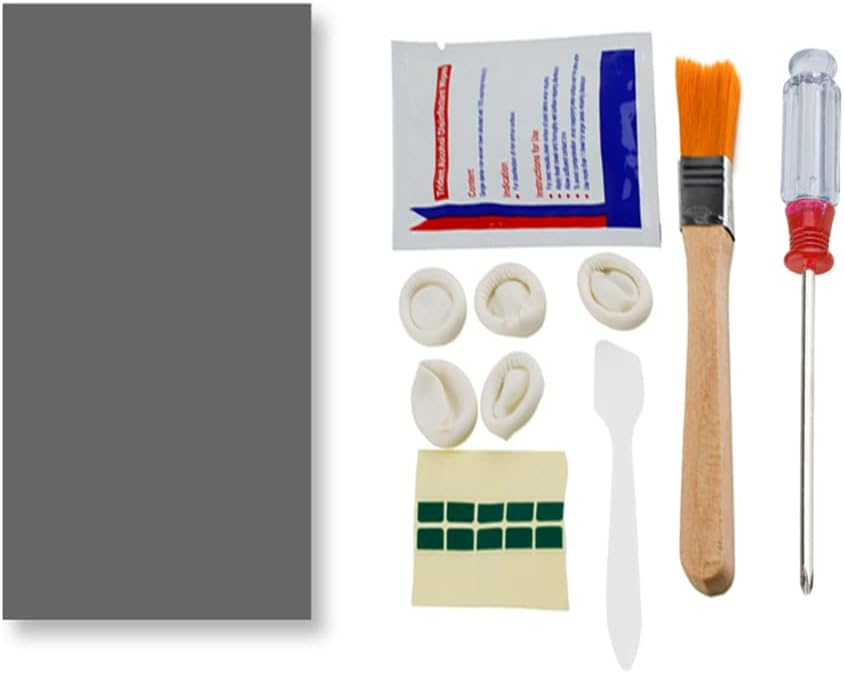

I first heard about the PTM7950 thermal interface material (TIM) from the [LTT Youtube Video](https://youtu.be/2BhKx0iQ4K8?si=_emraOiKlsbSqus0) where they discussed its performance compared to traditional thermal pastes and liquid metals. Intrigued by the claims of superior thermal conductivity and long-term stability, I decided to give it a try on my own laptop that was getting close to needing a thermal paste replacement. After waiting for more then 2 years I know it's time to replace the TIM (more like nearly 2 years to late), so I ordered an 80mm x 80mm sheet of PTM7950 to test it out.

Seeing how I'm a working man (not in the Jason Statham sense) I don't have the luxury of time to apply it then. A couple days later I finally got around to replacing the old thermal paste with the PTM7950. The application process was straightforward: First step is to place the PTM7950 sheet in the freezer for 15 to 1 hour to make it easier to cut and handle, next step is to cut the sheet to about the size of the CPU and/or GPU die. If it is a little larger that's fine, because like most thermal pads/pastes it is electrically insulating.

> Important Note: Unplug the battery and power supply before working on your laptop to avoid any electrical damage or personal injury.

Once the sheet is cut to size, I cleaned the CPU if my [Dell Inspiron 15 5505](https://www.dell.com/en-us/shop/dell-laptops/inspiron-15-5505-laptop/spd/inspiron-15-5505-laptop) which is about 5 years old at this point and still going strong. Using isopropyl alcohol and a lint-free microfiber cloth and soft brush removed the old thermal paste residue from and around the CPU and heatsink contact surfaces. Ensuring both surfaces were completely clean and dry before proceeding.

Once the the PTM7950 sheet was applied and the heatsink reinstalled and back cover secured, I powered on the laptop and monitored the temperatures through several heat cycles using [Geekbench](https://www.geekbench.com/) and transcoding a video with [HandBrake](https://handbrake.fr/). The results were nothing spectacular in the beginning, however after a couple days of use the temperatures under load lowered significantly: Between 10 - 15 degrees Celsius lower than with the old thermal paste. Going from a max temp of 101°C down to 86°C under heavy load. Idle temps stayed about the same around 45°C.

To me this was a clear indication that the PTM7950 was performing better than advertised and the promise of long-term stability with improvement over time seems to me what general consumer hardware OEMs should be using instead of traditional thermal pastes or liquid metals. By doing this we would see longer lasting PC hardware with better thermal performance over time.

This would lead to less e-waste as devices would not need to be replaced as often due to thermal issues: And lits face it most consumers don't no or bother to maintain their hardware properly aside from occasional cleaning and air dusting.

Overall, my experience with the PTM7950 has been very positive. The ease of application, improved thermal performance, and long-term stability make it a compelling choice for anyone looking to upgrade their laptop's thermal management. I would highly recommend it to others considering a thermal paste replacement, especially for those who want a hassle-free solution that delivers excellent results over time.

