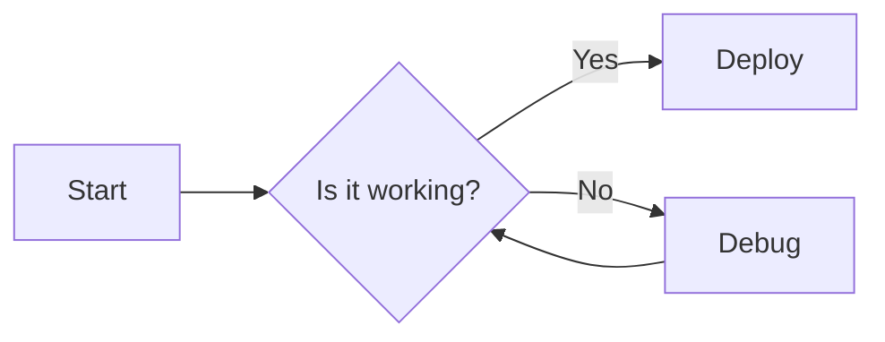

A list of some of the applications that are currently in development.

| Application   | Description                                                                                                              | Status         |
|---------------|--------------------------------------------------------------------------------------------------------------------------|----------------|
| ddnsd         | A dynamic DNS service daemon for updating DNS Cloudflare or DuckDNS records automatically.                               | maintained     |
| depot         | Manage you own local or remote Debian package repository with ease.                                                      | In Development |
| arcmenu       | Debian package of the Arc Menu GNOME Shell extension.                                                                    | In Development |
| dash-to-panel | Debian package of the Dash to Panel GNOME Shell extension.                                                               | In Development |
| zswapd        | A daemon to monitor and manage Linux zswap settings dynamically based on system memory usage.                            | In Development |
| btrfsd        | Create and manage Btrfs filesystems with a simple daemon and after installation/removal of packages.                     | In Development |
| grub-btrfsd   | Fork of [grub-btrfs](https://github.com/Antynea/grub-btrfs)) to automatically add Btrfs snapshots to the GRUB boot menu. | In Development |
| boa           | A dpkg-buildpackage wrapper to automate building and packaging of applications from source.                              | In Development |

If you are interested in contributing to any of these projects, please feel free to reach out!
