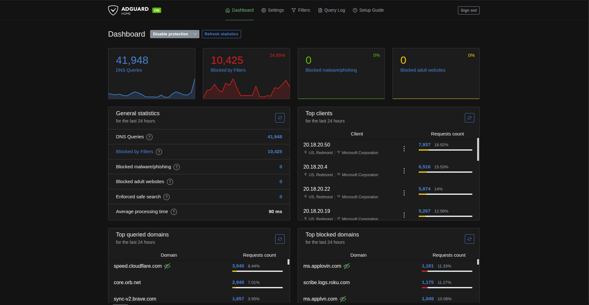
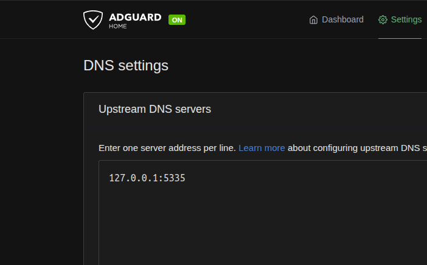

## Introduction

For a while I was using [Pi-Hole](https://pi-hole.net/) + [Unbound](https://unbound.net/) as my network-wide ad-blocker and recursive DNS resolver. While this setup worked well, I wanted something that had more features and a more polished user interface. I knew about [AdGuardHome](https://adguard.com/en/adguard-home/overview.html) for a [Youtube video](https://www.youtube.com/watch?v=B2V_8M9cjYw). But I never got around to trying it out until recently. When I desided to set up **AdGuardHome** all I know is that I wanted set it much like my how I had my **Pi-Hole** setup. Meaning I wanted to run it inside a Proxmox LXC container with **Unbound** as the recursive DNS resolver.

For those of you who don't know what **AdGuardHome** is: it is a local user or network-wide ad-blocking DNS server that blocks ads, trackers, and other unwanted content at the DNS level. It also has a nice web interface for managing settings and viewing statistics. In other words, it is like **Pi-Hole**, but with more features and a better UI.

In this guide, I will walk you through the steps to set up **AdGuardHome** inside a Proxmox LXC container with **Unbound** as the recursive DNS resolver.

I'm also going to assume you have a basic understanding of Proxmox and LXC containers. If you don't, I recommend checking out the [Proxmox documentation](https://pve.proxmox.com/wiki/Main_Page) before proceeding.

### Prerequisites

* *A Proxmox VE server with LXC support.
* *Basic knowledge of Proxmox and LXC containers.
* *A static IP address for the LXC container.
* *Access to your router's DNS settings to point to the AdGuardHome server.

## Getting Started

To get started, we will create a new LXC container in Proxmox. You can use any Linux distribution you prefer, but for this guide, I be using [Debian 13 template](https://www.debian.org/releases/stable/). First thing is to click on "Create CT" in the Proxmox web interface and follow the prompts to create a new container. Make sure to allocate enough resources (CPU, RAM, and storage) for **AdGuardHome** and **Unbound**.

The button is located in the top right corner of the Proxmox web interface.

> ### Configure the container with the following settings
>
> * General: Name your container (e.g., adguardhome), set the hostname, choose the password and import your SSH keys if desired.
>   * **hostname**: adguardhome
>   * ***password**: Leave blank for security reasons.
>   * ***SSH Keys**: Import your SSH (If you don't have one, you can generate one using `ssh-keygen` command on your local machine).
> * Template: Select the Debian 13 template.
>   * ***Template**: debian-13-standard_13.x-x.tar.gz
> * Disk: Stick with the default settings here.
> * CPU: Allocate at least 1 core.
> * *Memory: RAM + SWAP
>   * ***Memory**: 512MB (1GB recommended)
>   * ***Swap**: 512MB (1GB recommended)
> * *Network: Set a static IP address for the container.
>   * ***Bridge**: Use `vmbr0` or your preferred bridge.
>   * ***IPv4**: Static
>   * ***IP Address**: 192.168.1.100/24 (replace with your desired IP) the '/24' is the subnet mask and is required.
>   * ***Gateway**: 192.168.1.1 (replace with your network gateway)
> * *DNS: You can leave this as default.
> * *Confirm: Click the 'Start after created' checkbox and finish the setup.

Once the container is created and started, you can access it via SSH. Because we did not set a password during the creation process the WEB UI will not allow you to login using the console.

```bash
ssh -i /path/to/your/private/key root@192.168.1.100
```

Replace `/path/to/your/private/key` with the path to your SSH private key.

## Install Unbound DNS Resolver

Next, we will install **Unbound** as our recursive DNS resolver inside the LXC container. Follow these steps:

```bash
apt update && apt upgrade -y && apt install unbound -y
```

Next, we need to configure **Unbound**. Open the configuration file using your preferred text editor: `nano /etc/unbound/unbound.conf.d/adguardhome.conf`

Or download and install the configuration file directly using `curl`:`

```bash
curl -o /etc/unbound/unbound.conf.d/adguardhome.conf https://mlstidbits.com/guides/setup-adguardhome-inside-proxmox-lsc-container/AdGuardHome.conf
```

It should look like this:

```yaml
server:
    # If no logfile is specified, syslog is used
    logfile: "/var/log/unbound/unbound.log"
    verbosity: 1

    interface: 127.0.0.1
    port: 5335
    do-ip4: yes
    do-udp: yes
    do-tcp: yes

    # May be set to no if you don't have IPv6 connectivity
    do-ip6: no

    # You want to leave this to no unless you have *native* IPv6. With 6to4 and
    # Terredo tunnels your web browser should favor IPv4 for the same reasons
    prefer-ip6: no

    # Use this only when you downloaded the list of primary root servers!
    # If you use the default dns-root-data package, unbound will find it automatically
    #root-hints: "/var/lib/unbound/root.hints"

    # Trust glue only if it is within the server's authority
    harden-glue: yes

    # Require DNSSEC data for trust-anchored zones, if such data is absent, the zone becomes BOGUS
    harden-dnssec-stripped: yes

    # Don't use Capitalization randomization as it known to cause DNSSEC issues sometimes
    # see https://discourse.pi-hole.net/t/unbound-stubby-or-dnscrypt-proxy/9378 for further details
    use-caps-for-id: no

    # Reduce EDNS reassembly buffer size.
    # IP fragmentation is unreliable on the Internet today, and can cause
    # transmission failures when large DNS messages are sent via UDP. Even
    # when fragmentation does work, it may not be secure; it is theoretically
    # possible to spoof parts of a fragmented DNS message, without easy
    # detection at the receiving end. Recently, there was an excellent study
    # >>> Defragmenting DNS - Determining the optimal maximum UDP response size for DNS <<<
    # by Axel Koolhaas, and Tjeerd Slokker (https://indico.dns-oarc.net/event/36/contributions/776/)
    # in collaboration with NLnet Labs explored DNS using real world data from the
    # the RIPE Atlas probes and the researchers suggested different values for
    # IPv4 and IPv6 and in different scenarios. They advise that servers should
    # be configured to limit DNS messages sent over UDP to a size that will not
    # trigger fragmentation on typical network links. DNS servers can switch
    # from UDP to TCP when a DNS response is too big to fit in this limited
    # buffer size. This value has also been suggested in DNS Flag Day 2020.
    edns-buffer-size: 1232

    # Perform prefetching of close to expired message cache entries
    # This only applies to domains that have been frequently queried
    prefetch: yes
    module-config: "validator iterator"

    # One thread should be sufficient, can be increased on beefy machines. In reality for most users running on small networks or on a single machine, it should be unnecessary to seek performance enhancement by increasing num-threads above 1.
    num-threads: 1

    # Ensure kernel buffer is large enough to not lose messages in traffic spikes
    so-rcvbuf: 24m

    # Ensure privacy of local IP ranges
    private-address: 192.168.0.0/16
    private-address: 169.254.0.0/16
    private-address: 172.16.0.0/12
    private-address: 10.0.0.0/8
    private-address: fd00::/8
    private-address: fe80::/10

    # Ensure no reverse queries to non-public IP ranges (RFC6303 4.2)
    private-address: 192.0.2.0/24
    private-address: 198.51.100.0/24
    private-address: 203.0.113.0/24
    private-address: 255.255.255.255/32
    private-address: 2001:db8::/32
```

### (Optional) Download Root Hints

If **unbound** is installed via a package manager, there is a good chance that it not necessary to update. In general it is a good idea to update the root hints file periodically to ensure that your DNS resolver has the most up-to-date information about the root servers. You can download the latest root hints file using the following command:

```bash
curl -sfL -o /var/lib/unbound/root.hints https://www.internic.net/domain/named.root
```

This can be automated using either a cron job or systemd timer, I find that systemd timers are more reliable when it comes to scheduling tasks. Plus if the date and/or time is missed do to the system being powered off, the task will run as soon as possible after the system is powered back on.

Fist create a systemd timer file: `/usr/lib/systemd/system/unbound-root-hints.timer`

```ini
[Unit]
Description = Update root.hints file for unbound
Requires = unbound.service

[Timer]
OnCalendar = weekly
RandomizedDelaySec = 15m
Persistent = true

[Install]
WantedBy = timers.target
```

Next create the systemd service file: `/usr/lib/systemd/system/unbound-root-hints.service`

```ini
[Unit]
Description  =  Update root.hints file for unbound
After = network.target

[Service]
Environment = "URL=https://www.internic.net/domain/named.root"
Environment = "DEST_FILE=/var/lib/unbound/root.hints"
ExecStart = /usr/bin/curl -sfL -o "${DEST_FILE}" "${URL}"
ExecStartPost = /bin/systemctl reload unbound.service

[Install]
WantedBy = default.target
```

Enable and start the timer: `systemctl enable --now unbound-root-hints.timer`

Now if the authoritative root servers change, your **Unbound** DNS resolver will have the latest information to ensure proper DNS resolution. Once the DNS resolver is cached you notice a significant speed improvement when resolving domain names.

### Restart Unbound

After making the configuration changes, restart the **Unbound** service to apply the new settings: `service unbound restart`. Assuming there are no errors with the service, now check that DNS resolution is working correctly by using the `dig` command:

```bash
dig mlstidbits.com @127.0.0.1 -p 5335
```

If you see a valid response with an IP address and 'NOERROR' status, then **Unbound** is working correctly.

### Disable Unbound Resolver

Because we are going to be using **AdGuardHome** as the DNS resolver, we need to disable the default **Unbound** resolver in most cases this not even necessary, however this is just to be sure that there are no conflicts. First check that the service is not running: `systemctl is-active unbound-resolver.service`. If it is active, disable and stop the service using the following commands:

```bash
systemctl is-active unbound-resolvconf.service
```

If the service is not found or inactive, you can proceed to the next step to install **AdGuardHome**. Otherwise, the `resolvconf_resolvers.conf` file may need to be disabled and removed.

```bash
sed -Ei 's/^unbound_conf=/#unbound_conf=/' /etc/resolvconf.conf
rm /etc/unbound/unbound.conf.d/resolvconf_resolvers.conf
```

Restart the **Unbound** service again to apply the changes: `service unbound restart`.

## Install AdGuardHome

Now that we have our LXC container set up and running, we can proceed to install **AdGuardHome**. Follow these steps:

1. Update the package list and install necessary dependencies:

    ```bash
    apt update && apt upgrade -y
    apt install curl wget -y
    ```

2. Install AdGuardHome: [See steps here](https://github.com/AdguardTeam/AdGuardHome/blob/master/README.md#automated-install-linux-and-mac)

    ```bash
    curl -s -S -L https://raw.githubusercontent.com/AdguardTeam/AdGuardHome/master/scripts/install.sh | sh -s -- -v
    ```

3. Go to the IP address of your LXC container on port `3000` to access the AdGuardHome web interface: `http://192.168.1.100:3000`

4. Follow the on-screen instructions to complete the initial setup of AdGuardHome.

### Configure AdGuardHome to Use Unbound

Once you have completed the initial setup of **AdGuardHome**, you need to configure it to use **Unbound** as the upstream DNS server. Follow these steps:



The option is located under `Settings` > `DNS settings` > `Upstream DNS servers`. Add the following entry: `127.0.0.1:5335`. Scroll down and click *Test upstream* and if everything and a green box appears in the lower right corner saying *Specified DNS servers are working correctly*, click *Apply* to save the changes.

That is it! You have successfully set up **AdGuardHome** inside a Proxmox LXC container with **Unbound** as the recursive DNS resolver. You can now enjoy ad-blocking and enhanced privacy for your network.

## Conclusion

In this guide, we walked through the steps to set up **AdGuardHome** inside a Proxmox LXC container with **Unbound** as the recursive DNS resolver. This setup provides a powerful and flexible ad-blocking solution for your network, along with enhanced privacy features. Why this setup has benefits over using **Pi-Hole** is that **AdGuardHome**.

| Feature                     | AdGuardHome                  | Pi-Hole                      |
|-----------------------------|------------------------------|------------------------------|
| User Interface              | Modern and user-friendly     | Basic and functional         |
| Custom Filtering Rules      | Yes                          | Yes                          |
| DNS-over-HTTPS/TLS Support  | Yes                          | Limited                      |
| Parental Controls           | Yes                          | Limited                      |
| Cross-Platform Support      | Yes                          | Primarily Linux-based        |
| Regular Updates             | Frequent                     | Less frequent                |
| Community Support           | Growing                      | Established                  |
| Large default blocklists    | Extensive                    | Moderate                     |

Setting up the **Router** to use **AdGuardHome** as the primary DNS server is not covered in this guide because the location of the DNS settings varies depending on the router model and firmware. However, in general, you will need to log in to your router's web interface, navigate to the DNS settings section, and set the primary DNS server to the IP address of your **AdGuardHome** server (e.g., `192.168.1.100`).

Make sure to save the changes and restart your router if necessary. After doing this, all devices connected to your network will use **AdGuardHome** for DNS resolution, benefiting from ad-blocking and enhanced privacy features.
